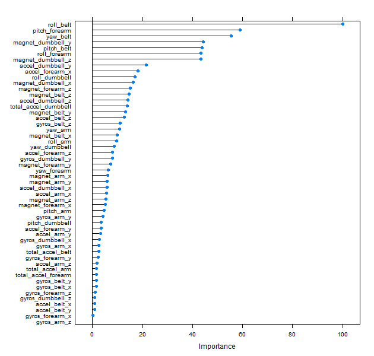

## Problem Statement

Using devices such as Jawbone Up, Nike FuelBand, and Fitbit it is now possible to collect a large amount of data about personal activity relatively inexpensively. These type of devices are part of the quantified self movement - a group of enthusiasts who take measurements about themselves regularly to improve their health, to find patterns in their behavior, or because they are tech geeks. One thing that people regularly do is quantify how much of a particular activity they do, but they rarely quantify how well they do it. In this project, your goal will be to use data from accelerometers on the belt, forearm, arm, and dumbell of 6 participants. They were asked to perform barbell lifts correctly and incorrectly in 5 different ways. More information is available from the website here: http://groupware.les.inf.puc-rio.br/har (see the section on the Weight Lifting Exercise Dataset). 

## Approach

Building ML model included following steps

1. **Feature Selection**

    + Removing insignificant columns
      Few columns like *user_name*, *raw_timestamp_part_1*, *new_window* etc don't add any value to the data set. These columns which are less significant are removed(code below).
      
      `
      training <- subset(training,select = -c(X,user_name,raw_timestamp_part_1,raw_timestamp_part_2,cvtd_timestamp,new_window,num_window))
      `
      
    + Removing columns in which 90% of data is NA or empty
      
    
      `
      training <- training[,colSums(is.na(training)) <= nrow(training)*.9]
      `
      `
      training <- training[,colSums(training != "") >= nrow(training)*.9]
      `
      
    After this process data set has 53 features.
    
2. **Validation Set**

    + Created validation set with 10% of training set.
      
      `
        inTrain <- createDataPartition(training$classe,p=0.9,list=FALSE)
      `
      `
        valid <- training[-inTrain,]
      `
      `
        train <- training[inTrain,]
      `
    + I have also created another validation set with 10% of training set(helps in cross verification of results)
    
3. **Parallelize the process**

    + Training the model is computationally intensive process and it takes lot of time. Enabling parallel processing helps in reducing training time.
      `
        library(doParallel)
      `
      `
        cl <- makeCluster(detectCores())
      `
      `
        registerDoParallel(cl)
      `
  
4. **PreProcessing and Training the model**

    + I have used **repeatedcv** with 3 folds and 5 repeatitions for better performance. 
    
      `
      tc <- trainControl("repeatedcv", number=3, repeats=5, classProbs=TRUE, savePred=T) 
      `
      
    + Built a model using **Random Forest** method with above **trainControl** parameters. Training data is preProcessed with **center & scale** method
    
      `
      modFitTC <- train(train1$classe ~.,data = train1,method="rf",trControl = tc, preProcess = c("center","scale"))
      `
  
5. **Results**

    + Following are the results on validation set
    ```{r}
    read.csv(file="result.csv",header = TRUE)
    ```
    
6. **Variable Importance**
    
    + Plot variable importance to understand which feature is contributing in prediciton. Number of features can be trimmed according to the order of importance for better performance.
    
    
